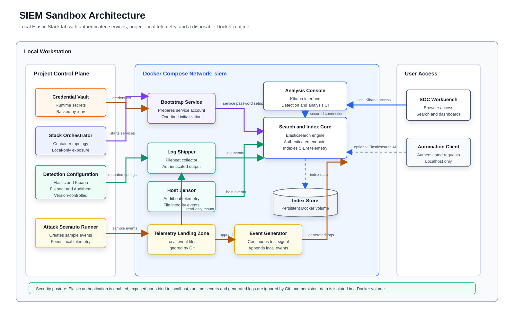

# SIEM Sandbox: Elastic Stack + Beats

A local, Docker Compose based security monitoring lab for learning detection engineering, log analysis, and incident response workflows.

The stack runs Elasticsearch, Kibana, Filebeat, Auditbeat, and a small synthetic log generator. It is designed to be disposable, portfolio-ready, and safe to run on a workstation with local-only service exposure and password-protected Elastic services.


## What You Get

- Elasticsearch and Kibana secured with built-in authentication.
- Filebeat collection from project-local logs in `logs/`.
- Auditbeat host telemetry for process, login, user, host, and file integrity activity.
- Synthetic security events for failed logins, suspicious file creation, and privilege escalation testing.
- Local-only ports bound to `127.0.0.1` by default.
- Version-aligned Elastic components managed through `.env`.

## Architecture



The architecture view is available as a rendered [SVG](docs/architecture.svg). The repository also includes the editable diagrams.net source at [docs/architecture.drawio](docs/architecture.drawio). The diagram covers the repository inputs, local telemetry generation, Docker Compose services, authenticated Elastic ingestion paths, Kibana access, and persistent storage.

## Requirements

- Docker Desktop or Docker Engine with Compose v2.
- At least 4 GB of available memory for the stack.
- macOS, Linux, or Windows with a POSIX-compatible shell for `simulate-attacks.sh`.

## Quick Start

1. Create your local environment file:

```bash
cp .env.example .env
```

2. Replace the default passwords in `.env`:

```dotenv
ELASTIC_PASSWORD=use-a-strong-local-password
KIBANA_SYSTEM_PASSWORD=use-another-strong-local-password
```

3. Start the stack:

```bash
docker compose up -d
```

4. Open Kibana:

```text
http://localhost:5601
```

Sign in with:

```text
Username: elastic
Password: the ELASTIC_PASSWORD value from .env
```

5. Generate sample events:

```bash
./simulate-attacks.sh
```

## Useful Commands

```bash
docker compose ps
docker compose logs -f elasticsearch kibana filebeat auditbeat
docker compose down
docker compose down -v
```

Use `docker compose down -v` only when you want to delete the Elasticsearch data volume and start fresh.

## Detection Ideas

- Failed SSH login bursts from a single source IP.
- Sudoers or privilege escalation related changes.
- Suspicious credential dumping filenames.
- Unexpected binaries or scripts under temporary directories.
- File integrity changes under `/bin`, `/usr/bin`, `/sbin`, or `/usr/sbin`.

## Project Layout

```text
.
├── auditbeat/              # Auditbeat modules and output settings
├── elastic/                # Elasticsearch node configuration
├── filebeat/               # Filebeat log input and output settings
├── images/                 # Kibana screenshots for documentation
├── kibana/                 # Kibana server configuration
├── logs/                   # Local generated logs consumed by Filebeat
├── docker-compose.yml      # Secure local Elastic Stack orchestration
├── .env.example            # Environment template
└── simulate-attacks.sh     # Synthetic event generator
```

## Security Posture

This project is still a local lab, not a production deployment. The defaults are hardened for workstation use:

- Elastic security is enabled.
- Kibana uses the `kibana_system` service account password.
- Beats authenticate to Elasticsearch.
- Elasticsearch and Kibana ports bind to localhost only.
- Containers use `no-new-privileges` where practical.
- Generated logs and local secrets are ignored by Git.

For production-like environments, add TLS certificates, dedicated least-privilege Beats users, persistent secret management, endpoint hardening, and external network controls.

## Screenshots


